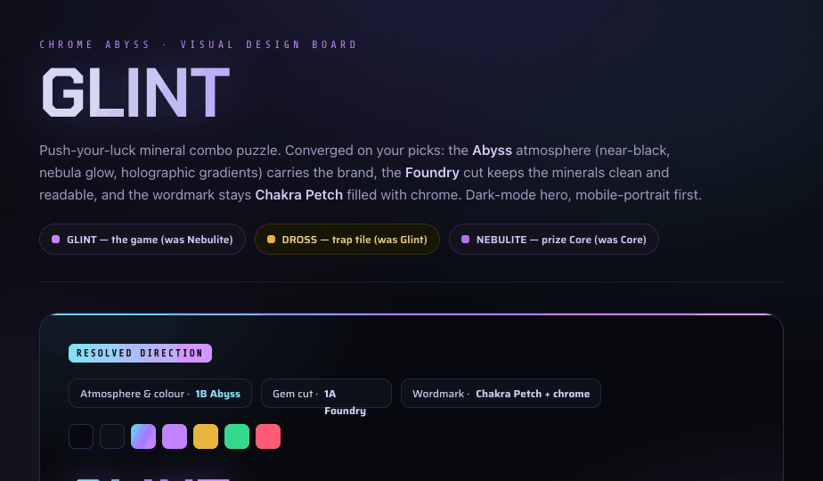
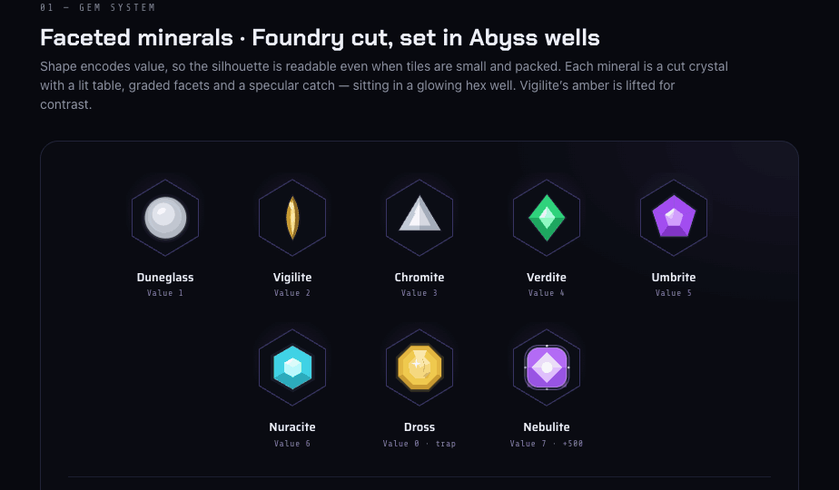
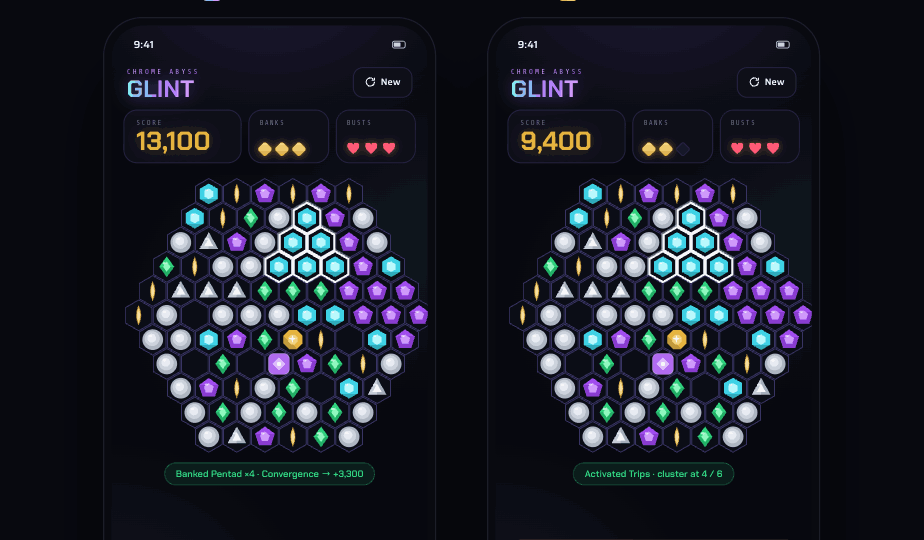
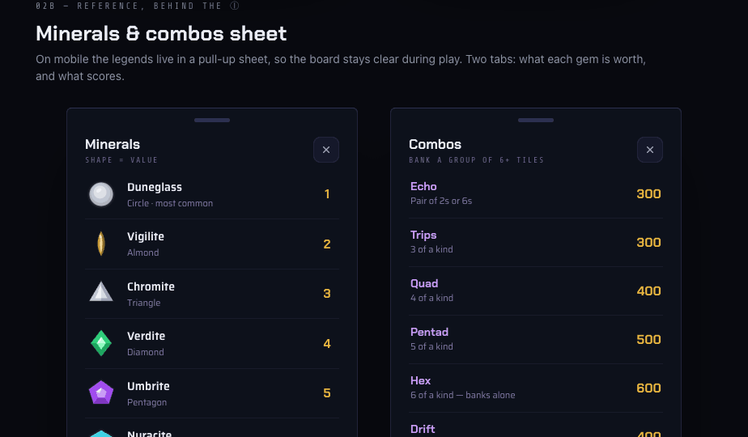
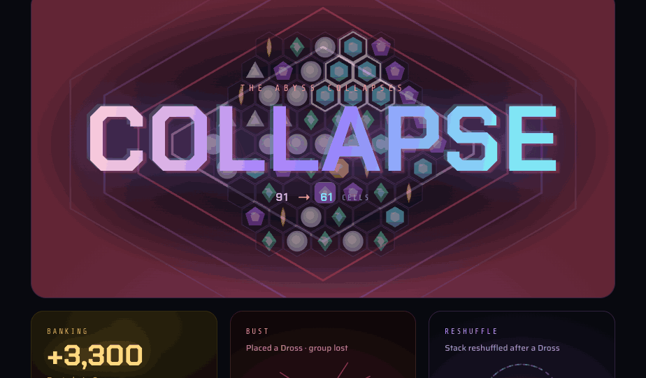
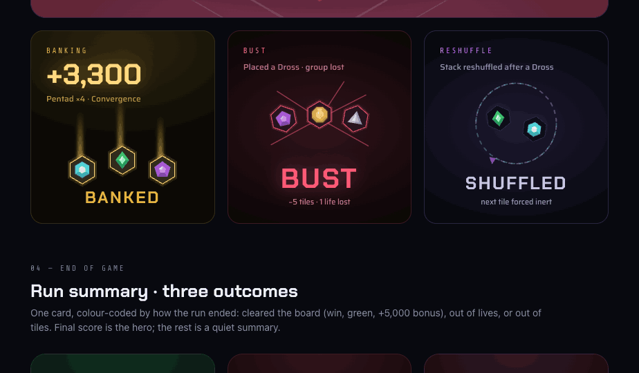
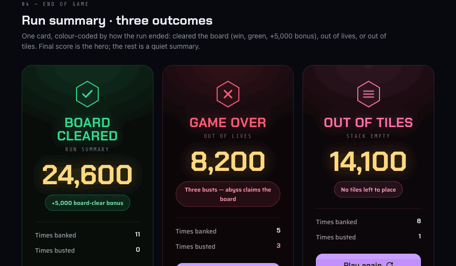
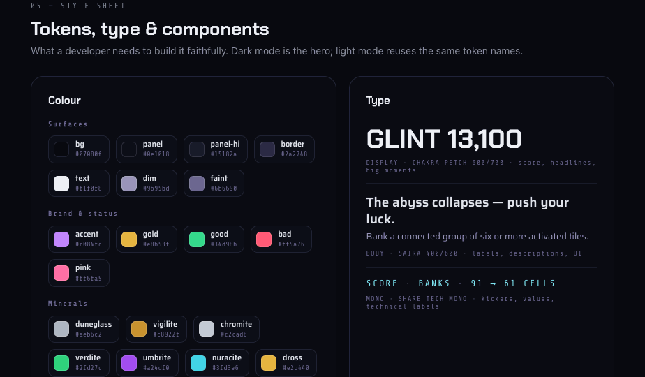
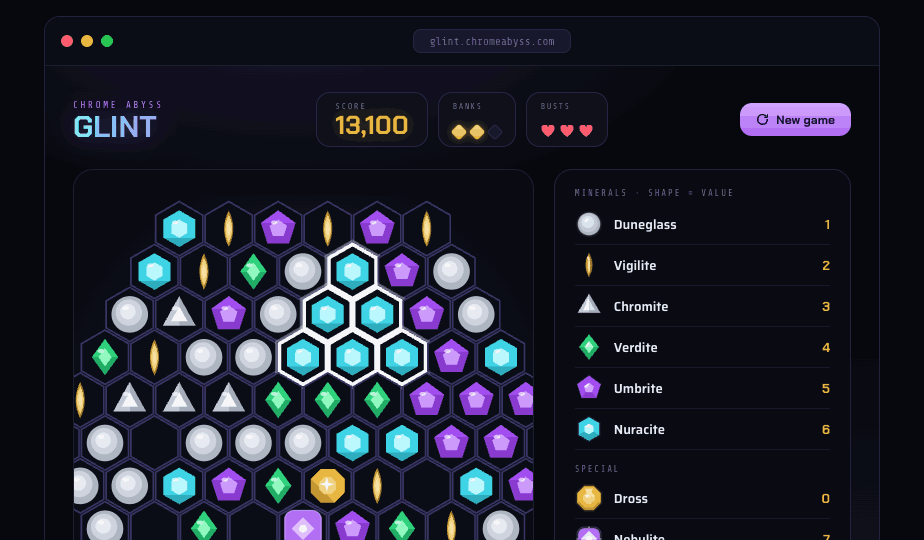
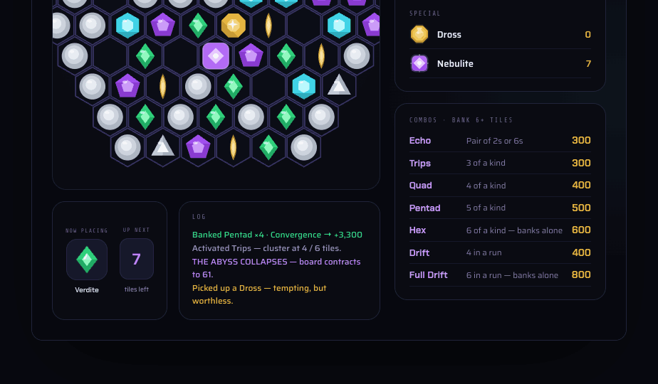

# Handoff: Chrome Abyss — Glint

> Visual UI design for **Chrome Abyss: Glint** — a single-player, push-your-luck mineral combo puzzle (working title was *Nebulite*). This package is the complete designed interface: the gem set, the in-game screen, the HUD, the timed prompts, the dramatic moments, the end screens, a desktop layout, and the motion specs.

---

## Overview

Glint is a tactile, sci-fi puzzle in the Chrome Abyss universe. The player clears a **pointy-top hexagonal board of mineral gems** by placing gems from a hand. Placing a gem next to matching gems **activates a combo** (it glows); when a connected group of **6+ activated tiles** forms, it **banks** (scores and clears). The tension is risk: place a gem that can't form a combo and you **bust**, losing your built-up group. Limited lives, a few "bank early" safety nets, and a mid-game board **shrink** create the drama. Highest score wins.

The look: **premium, calm, tactile, sci-fi-mineral**, on the holographic-chrome thread of [chromeabyss.com](https://www.chromeabyss.com). Dark-mode is the hero; mobile-portrait is the priority.

---

## About the design files

The files in this bundle are **design references created in HTML** — prototypes that show the intended look, layout, and motion. **They are not production code to copy directly.** The task is to **recreate these designs in the target codebase's environment** (the brief says it will be built in **React (web)**), using its established component patterns, state libraries, and conventions. If no environment exists yet, React is the intended target.

Each `*.dc.html` file is a self-contained component prototype. Open `Glint.dc.html` in a browser to see the full design board; open `Glint Motion.dc.html` to see every animation looping. The gems, cells, and board are real, reusable building blocks — mirror them as real components.

> The HTML uses a small in-house runtime (`support.js`) only so the prototypes render standalone. **Do not port that runtime.** Read the JSX-like templates and the logic classes as a spec for props, structure, and behaviour.

---

## Fidelity

**High-fidelity (hi-fi).** Final colours, typography, spacing, gem artwork, component states, and motion timings. Recreate the UI faithfully using the codebase's libraries. Exact hex values, type, radii, and easing are given below.

---

## Visual reference — renders

PNG renders of the design board are in **`renders/`** (captured at ~924px wide — open the `.dc.html` files for full detail and live motion).

**Overview & resolved direction** — the merged look (Abyss atmosphere + Foundry gem cut + Chakra Petch chrome wordmark).

**Gem system** — the eight minerals (Foundry cut) in their Abyss wells, plus tile states.

**In-game · mobile portrait** — normal play (left) and the timed BANK prompt (right).

**Minerals & combos sheet** — the reference legends that live behind the ⓘ on mobile.

**THE ABYSS COLLAPSES** — the board-shrink centrepiece (static peak frame).

**Banking · Busting · Reshuffle** — the smaller hero moments.

**End of game** — board cleared / game over / out of tiles.

**Style sheet** — colour tokens, type scale, components, radii.

**Desktop layout** — board + hand + log on the left, legends as a side rail.

> Live motion (every beat looping with timing/easing) is in **`Glint Motion.dc.html`** — see the **Motion & transitions** table below.

---

## The game (rules the UI must serve)

Implement this model; the UI is built around it.

**Minerals** — shape encodes value (a core gameplay read; shapes must stay distinct at small sizes):

| Value | Name | Shape | Deck notes |
|---|---|---|---|
| 1 | Duneglass | Circle | most common (~25 in deck) |
| 2 | Vigilite | Vertical almond / eye | |
| 3 | Chromite | Triangle | |
| 4 | Verdite | Diamond | |
| 5 | Umbrite | Pentagon | |
| 6 | Nuracite | Hexagon | rarest (~10 in deck) |

**Special tiles:**
- **Dross** (value 0, gold) — a **trap**. Worthless; **placing it always busts**. Designed to look tempting (gleaming, sparkly gold) with subtle "off" tells (a hairline crack, a tarnished patch, a faint oily fool's-gold film). *(Renamed from "Glint" so the game can take that name.)*
- **Nebulite** (value 7, brand purple) — a **prize Core**. **Cover it for +500.** Acts as a **joker/wildcard**: when standing in for another gem it mirrors that gem's colour while keeping its purple Core ring. *(Renamed from "Core" — it inherits the game's old name.)*

**Loop:**
1. Player places the **current gem** (hand → board cell).
2. If it lands adjacent to matching gems, the connected group **activates** (glows white).
3. When a connected group of **6+ activated tiles** forms one or more combos, it **banks automatically** (scores, clears those cells, leaves gaps).
4. Otherwise the player gets a **~3-second window to bank early** ("free bank"). **3 free banks** per run (gold diamond pips, fill down).
5. If the placed gem can form **no combo**, the player **busts** — the built-up group is lost. **3 busts** allowed (heart pips, fill down); at 0 it's **Game Over**.
6. When only **30 tiles remain**, the board **shrinks from 91 cells (side-6 hexagon) to 61 cells (side-5)** — "THE ABYSS COLLAPSES".
7. Placing a **Dross** always busts; after a bust or a Dross the stack **reshuffles**.

**Combos & scoring** (bank a group of 6+ tiles):

| Combo | Rule | Points |
|---|---|---|
| Echo | Pair of 2s or 6s | 300 |
| Trips | 3 of a kind | 300 |
| Quad | 4 of a kind | 400 |
| Pentad | 5 of a kind | 500 |
| Hex | 6 of a kind — banks alone | 600 |
| Drift | 4 in a run (consecutive values) | 400 |
| Full Drift | 6 in a run — banks alone | 800 |

- **Chains** — two combos in one banked group are summed **after** the ×multiplier.
- **Board-clear bonus**: **+5,000** if the board is fully cleared (win).
- **Nebulite/Core cover**: **+500**.

**End states:** **Board cleared** (win, green, +5,000) · **Game over** (out of lives, red) · **Out of tiles** (stack empty, pink).

---

## Design tokens

Dark mode (the hero). Light mode reuses the same token names.

### Colour — surfaces
| Token | Hex | Use |
|---|---|---|
| `bg` | `#07080f` | page / screen background (near-black) |
| `panel` | `#0e1018` | cards, HUD boxes |
| `panel-hi` | `#15182a` | raised surfaces, slots, chips |
| `border` | `#2a2748` | hairlines (violet-tinted) |
| `text` | `#f1f0f8` | primary text |
| `dim` | `#9b95bd` | secondary text (violet-tinted) |
| `faint` | `#6b6690` | tertiary / mono labels |

The page sits on `#08090f` with layered radial **nebula glows**: `radial-gradient(1100px 640px at 50% -8%, rgba(124,90,224,.18), transparent 60%)`, plus cyan top-right `rgba(64,200,224,.08)` and magenta bottom-left `rgba(224,139,255,.07)`.

### Colour — brand & status
| Token | Hex | Use |
|---|---|---|
| `accent` | `#c084fc` | brand purple, primary buttons |
| `gold` | `#e8b53f` | score, banking, free-bank pips |
| `good` | `#34d98b` | success / board cleared |
| `bad` | `#ff5a76` | bust / danger / lives |
| `pink` | `#ff6fa5` | out-of-tiles end state |

**Signature gradient** (wordmark, big moments): `linear-gradient(100deg, #7fe9f5, #9d7bff 50%, #e08bff 85%)` — the holographic chrome. Often with `filter: drop-shadow(0 2px 18px rgba(157,123,255,.5))`.

### Colour — minerals (core hue per gem)
| Gem | Hex |
|---|---|
| Duneglass | `#aeb6c2` |
| Vigilite | `#c8922f` (amber, **lifted** from the old dark `#3a332a` for contrast) |
| Chromite | `#c2cad6` |
| Verdite | `#2fd27c` |
| Umbrite | `#a24df0` |
| Nuracite | `#3fd3e6` |
| Dross | `#e2b440` (gold) |
| Nebulite | `#b36bf5` (brand purple) |

### Typography
- **Display — `Chakra Petch`** (600/700). Wordmark, score, headlines, big moments. The **GLINT wordmark** uses Chakra Petch 700 filled with the signature chrome gradient.
- **Body — `Saira`** (300–700). Labels, descriptions, UI text. (Also the base UI sans.)
- **Mono — `Share Tech Mono`** (400). Kickers, values, technical labels — letter-spacing `.16em–.34em`, often uppercase.

Type scale (in-game): wordmark 27px · score 30–31px · HUD label 8.5px mono · combo/legend names 13–14px · body 12.5–15px.

### Radii
`22` cards · `16` HUD / tiles · `12–14` chips & buttons · `999` pills. (Phone bezel `38–46`.)

### Spacing — 4pt base
`4 · 8 · 12 · 16 · 24` (and `40–60` between board sections).

### Elevation
Flat panels: `1px solid var(--border)` on `var(--panel)`. Lifted (sheets, end cards, device): `0 40px 80px -30px rgba(0,0,0,.7)` and stronger for the device frame.

---

## The gem system (the centrepiece)

Each gem is a **faceted, lit crystal**, not a flat shape — built from layered SVG polygons: a silhouette (mid hue) → a darkened lower facet for depth → a lit **table** (light hue) → a white **specular** catch → a thin rim. They sit in a **hex "well"** (the cell): near-black `#0b0d16` with a violet radial inner glow `radial-gradient(circle at 50% 42%, rgba(124,90,224,.16), #0b0d16 70%)` and a `#383463` stroke.

Per-gem construction (see `Gem.dc.html` for exact polygon coordinates on a `0 0 100 100` viewBox):
- **Duneglass** — glassy cabochon: stacked offset circles (mid → light) + specular + faint engraved ring.
- **Vigilite** — vertical almond (vesica) path; darker right lobe, bright central spine, top glint. Amber lifted to read on dark.
- **Chromite** — upward triangle split into a lit left / shaded right face + inner table + apex glint.
- **Verdite** — brilliant diamond: 4-facet table + shaded lower half + spokes + glint.
- **Umbrite** — pentagon: 5 girdle facets fanning from a lit table.
- **Nuracite** — hexagon: 6 girdle facets + lit table; the most jewel-like (rarest).
- **Dross** — **emerald/step-cut gold octagon**: bright lustrous gold steps + a 4-point **sparkle** glint (bait), with subtle tells — a hairline **fracture** (`#7a5a12`), a **tarnished** olive patch (`#8f8458`), and a faint **oily film** (`#9fc24a`). Reads as treasure at a glance, "off" on a closer look.
- **Nebulite** — rounded-square Core: brand-purple cushion + glowing inner diamond + bright energy core + a `#e0bbff` ring + orbiting sparkle dots. **Joker state** = render the mimicked gem's shape/colour inside the purple Core ring.

**Tile states** (rendered as overlays on the cell, see `Cell.dc.html`):
- **Normal** — gem in well.
- **Activated** — built combo, not yet banked: **white** pointy-top hex glow (a 3px stroke + 2 softer outer strokes). This is the key "selected" read.
- **Banked** — the scoring flash: **gold** ring (`#ffd980`) + gold fill glow. Brief, on the way to clearing.
- **Danger** — tiles about to be pulled away (e.g. during the shrink): **red** (`#ff5a76`) ring + faint red fill.
- **Joker Core** — Nebulite standing in: purple `#c084fc` ring around the mimicked gem.

> **Performance note:** in the prototype the **full board** is drawn as one lightweight inline SVG (simplified gems) for speed, while the **legend/hand/showcase** use the full-detail gem component. In production, build **one** gem component and let it render at any size; memoise board cells.

---

## Screens

### 1. In-game screen — mobile portrait (the hero)
Top→bottom inside a 392-wide device (see `Screen.dc.html`):
- **Status bar** (mock) → **Header**: kicker `CHROME ABYSS` (mono, accent) + **GLINT** wordmark (Chakra Petch 27px, chrome gradient); right: **New** button (ghost: `panel` bg, `border`, refresh icon + label, radius 12).
- **HUD row** (three boxes, `panel` / `border` / radius 16):
  - **SCORE** (flex 1.6) — mono label + number in Chakra Petch 31px `gold` with `text-shadow:0 0 20px rgba(232,181,63,.28)`.
  - **BANKS** — three **gold diamond** pips (13px, rotated 45°, `linear-gradient(135deg,#f4d885,#e8b53f)`, glow). Used ones become `panel-hi` with `border`.
  - **BUSTS** — three **heart** pips (`bad`, glow). Lost ones become hollow (`border` stroke). Both groups **fill down**.
- **Board** — the hex grid, centred, 366px wide, the focal element. Empty cells (after banking) show just the well.
- **Toast** — a single pill above the hand: `good` text on `rgba(52,217,139,.1)` with `good`-tint border, radius 999. e.g. *"Banked Pentad ×4 · Convergence → +3,300"*.
- **Hand** (`panel`, radius 20): **NOW PLACING** (mono label + 60px slot on `panel-hi` holding the current gem at 44px + gem name) · **UP NEXT** (a stacked-card badge showing tiles-remaining count in `accent`) · **ⓘ** info button (opens the sheet).
- **Timed BANK prompt** (appears after a combo, only while free banks remain): a full-width gold button above the hand — a **3-2-1 countdown ring** + number, **"BANK NOW"**, "tap to lock points". `border` + `linear-gradient(180deg, rgba(232,181,63,.22), rgba(232,181,63,.1))`, `gold` text.

Reference panels (minerals + combos) are **not** on screen during mobile play — they live behind the **ⓘ**.

### 2. Minerals & combos sheet (behind ⓘ)
A pull-up bottom sheet (`panel` `#0d111b`, top corners ~6px, bottom 22px, top handle bar, lift shadow). Two tabs:
- **Minerals** — "SHAPE = VALUE". Rows: gem (36px) + name (Saira 14px) + shape descriptor (dim) + value (Chakra Petch, `gold`). Then a **SPECIAL TILES** group (Dross, Nebulite).
- **Combos** — "BANK A GROUP OF 6+ TILES". Rows: name (Chakra Petch, `#c79bf5`) + rule (dim) + points (Chakra Petch, `gold`). Footer **CHAINS** note (`#7fe9f5` tag).

### 3. End of game — one card, three outcomes
Centred result card (radius 22), colour-coded, each with: a faceted-hex **status badge**, headline (Chakra Petch 27px), a mono sub-status, the **final score** (Chakra Petch 56px, `gold`, glow), a status pill, a hairline divider, a **summary** (`Times banked` / `Times busted`, values in Chakra Petch), and a **Play again** button (primary purple gradient + refresh icon).
- **BOARD CLEARED** — `good`; check badge; adds a **"+5,000 board-clear bonus"** pill.
- **GAME OVER** — `bad`; X badge; "OUT OF LIVES".
- **OUT OF TILES** — `pink`; empty-stack badge; "STACK EMPTY".

In play these appear as a **modal over a dimmed board**.

### 4. Desktop layout (bonus)
Browser-window framing. Header: GLINT wordmark (left) · HUD SCORE/BANKS/BUSTS (centre) · New game (right, primary). Body is a two-column grid: **left** = big board panel (board scaled up) + a row of **NOW PLACING / UP NEXT** and a **LOG** feed (colour-coded lines: `good` banked, `dim` activations, `accent` system, `gold` Dross, `bad` bust); **right** = a side rail with the **MINERALS** and **COMBOS** legend panels. Same tokens and gems as mobile.

---

## Components (reusable)

| Component | Notes |
|---|---|
| **Gem** | props: `type` (8 minerals + dross/nebulite), optional joker target. Renders the faceted SVG. |
| **Cell** | a hex well + optional Gem + state ring. props: `type`, `state` (normal/activated/banked/danger/joker), `empty`. |
| **Board** | pointy-top hex grid; props: `size` (large=91 / small=61). Cells positioned by axial→pixel: `x = cw·(q + r/2)`, `y = 1.5·R·r`, `cw = √3·R`. |
| **Pip group** | 3 pips, fill-down. Banks = gold diamonds; Busts = hearts. |
| **Stat box** | mono label + value; `panel`/`border`/16. |
| **Button** | primary (purple gradient, dark text), bank (gold), ghost (`panel-hi`/`border`). |
| **Banner / toast** | success (green), bust (red), system (accent) pills. |
| **Card / sheet** | `panel`, 18–22 radius, hairline border, lift shadow for overlays. |

---

## Motion & transitions

See **`Glint Motion.dc.html`** — every beat loops continuously with timing/easing. These are the production targets.

| Moment | Beats | Duration · easing |
|---|---|---|
| **Place & activate** | Tile drops in with an **overshoot bounce**; matching neighbours light a white hex glow, **staggered ~80ms**. | drop **250ms ease-out** · glow 200ms |
| **Banking** | Activated rings flash **white → gold**; tiles **arc up to the SCORE and shrink out**; score **pops** and the **+amount counts up**; gold rays burst. Weighty, gold. | **~700ms ease-in** |
| **Busting** | Group **shakes** (~350ms), red **cracks** fire, tiles **scatter + fade**, **"BUST"** stamps in (scale 2.3×+blur → 1×); a **life pip drains**. Sharp, not punitive. | **~600ms ease-in** |
| **Timed bank prompt** | A **~3s** window: a **ring + bar drain together**, digits **step 3·2·1** (`steps(1)`), the card **pulses**. Urgent, not stressful. | **3s linear** |
| **Reshuffle** | A violet **"RESHUFFLE" banner sweeps** across while remaining tiles **spin in place**. Lighter than a bust. | **~900ms ease-in-out** |
| **THE ABYSS COLLAPSES** | The **centrepiece**. Board **shakes** (~350ms) → **"COLLAPSE"** slams in (scale 2.7×+blur → 1×, chrome gradient) → a **shockwave hex ring** fires + **danger vignette** flares → grid **contracts 91 → 61**. | **~1.8s total** (shake · slam · contract) |

Plus micro-transitions: score number **count-up** on bank; pip **fill-down** on use/loss; toast/banner **slide+fade**; gem **placement** snap.

> In the prototype these are CSS keyframes on a non-re-rendering view. In React, drive them with your animation library (Framer Motion / CSS transitions). The board shrink should re-flow cell positions between the two layouts, not just scale.

---

## State management

Core run state to model:
- `board`: map of cell → { gem type, state } across the active layout (91 or 61 cells).
- `boardSize`: `large | small` (switches at 30 tiles left).
- `hand`: `current` gem + hidden `stack` (count shown, values hidden) + `tilesRemaining`.
- `activatedGroup`: the connected set of activated cells (drives the white glow + bank eligibility).
- `score` (animated count-up), `banksLeft` (0–3), `livesLeft` (0–3).
- `pendingBank`: { active, secondsLeft } — drives the timed prompt; only offered while `banksLeft > 0` and the group isn't an auto-bank (6+).
- `status`: `playing | cleared | gameover | outoftiles`.
- `log`: recent one-line events (feed/toast).

Transitions: **place** → recompute activation → if 6+ connected & forms combo(s) → **auto-bank**; else start **pendingBank** timer; if no combo possible → **bust** (lose group, −1 life, reshuffle); at 30 tiles → **collapse**; at 0 tiles or 0 lives or cleared → **end**.

---

## Assets

- **`favicon.svg`** — a faceted chrome-gradient hexagon gem on a dark rounded square; reads down to 16px. Use as the app favicon / icon seed.
- **Fonts** (Google Fonts): `Chakra Petch`, `Saira`, `Share Tech Mono`.
- **Icons** are inline SVG (refresh, info, close, check, X) — replace with the codebase's icon set.
- No raster art; every gem and effect is vector/CSS and should be rebuilt as components.

---

## Files in this bundle

| File | What it is |
|---|---|
| `Glint.dc.html` | **The full design board** — resolved direction, gem system, in-game (2 states), info sheet, hero moments, end screens, style sheet, desktop. Start here. |
| `Glint Motion.dc.html` | **Motion spec** — every animation looping, with timing/easing captions. |
| `Gem.dc.html` | Faceted gem component (8 minerals + Dross + Nebulite) — exact SVG facet geometry. |
| `Cell.dc.html` | Hex well + gem + state rings (normal / activated / banked / danger / joker). |
| `Board.dc.html` | The hex grid (large 91 / small 61), axial→pixel layout, as one performant SVG. |
| `Screen.dc.html` | The mobile in-game screen (HUD, board, hand, timed bank prompt). |
| `favicon.svg` | Gem favicon. |
| `support.js` | Prototype runtime only — **do not port**; read templates/logic as spec. |

Open the `.dc.html` files in a browser to view. They reference each other and `support.js` as siblings, so keep them in the same folder.

---

## Implementation notes

- **Mobile-first, portrait.** Board is the hero; hand in thumb-reach; legends behind the ⓘ. Desktop brings the legends back as a side rail.
- **Accessibility:** value is encoded by **shape** (not colour alone) — preserve that. Keep contrast strong; Vigilite's amber was lifted specifically for this. Mobile hit targets ≥ 44px.
- **Dark mode is the hero.** Light mode (same token names) is a later pass — not designed here.
- **Premium, no F2P loudness.** Subtle borders, soft shadows, calm panels, restrained accent. Gold = reward; red = danger; purple = brand/system; cyan = special/rare.
- Build **one** Gem component and reuse everywhere; memoise board cells; animate via your motion library.
