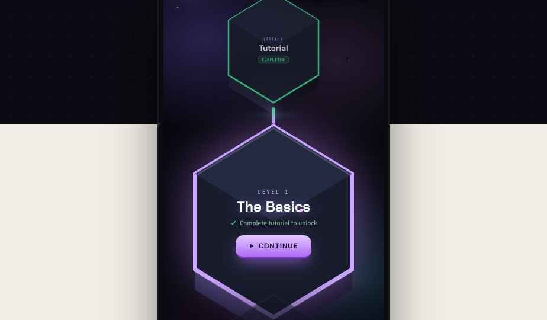
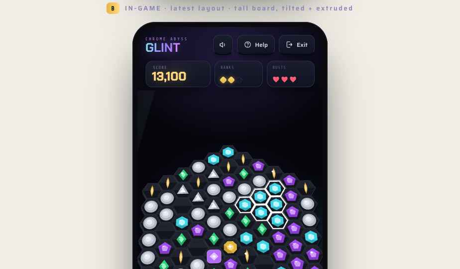
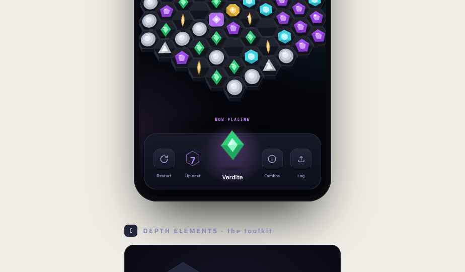
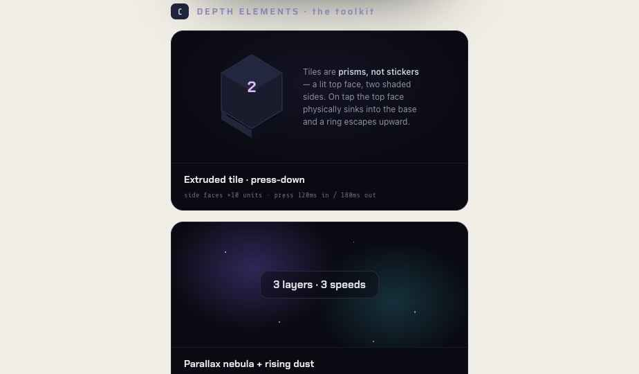
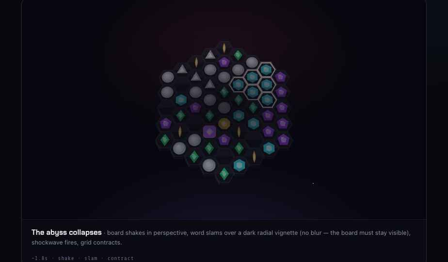
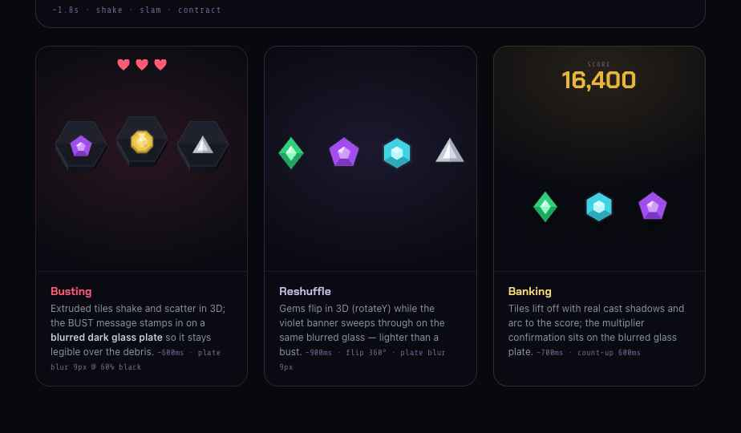

# Handoff: Chrome Abyss — Glint · **Depth Pass (3D / dynamic style)**

> The art-direction upgrade that takes Glint from flat-clean to a **living 3D space** — extruded tiles, parallax, perspective, cast light, levitation — plus the restaged animations (BUST / RESHUFFLE / COLLAPSE / BANK) with legibility plates. This is a **delta briefing**: it updates the master `design_handoff_glint` (and the layout in `design_handoff_glint_enhancements`) element by element. Where this document conflicts with the older bundles, **this one wins**.

---

## Overview — the five moves
1. **Extrusion** — tiles are prisms (lit top face + shaded side walls), not stickers.
2. **Parallax** — a layered nebula that drifts at different speeds, with rising dust motes.
3. **Perspective** — the board is a tilted surface you look down onto; cards tilt in true 3D.
4. **Cast light** — glows, gloss sweeps, blooms and soft shadows replace hairline borders.
5. **Levitation** — held pieces, islands and UI float, hover and settle; nothing is pinned.

Candy-Crush alive; tech/sci-fi skin. All motion is GPU-cheap (`transform`/`opacity` only).

## About the design files
HTML **design references / working prototypes** — recreate in the target codebase (**React, web**). `support.js` is the prototype runtime — **do not port**. Open **`Glint Depth.dc.html`** (screens + toolkit) and **`Glint Motion 2.dc.html`** (restaged animations) in a browser; everything loops live.

## Fidelity
**High-fidelity** — geometry, colours, and timings below are the production targets.

---

## Element briefings

### 1 · Extruded tiles (board cells)
The cell is drawn in three stacked parts (see `Board.dc.html`, `extrude` mode):
- **Base** — the top-face hexagon offset **down by `exd = wellR × 0.34`** (~6px at board scale), fill `#05060d`, hairline `#0b0c15`.
- **Side walls** — quads connecting top-face lower edges to the base. Light from top-left: **left wall `#262b3a`** (lightest), **bottom wall `#10121d`**, **right wall `#0a0b13`** (darkest). (Pointy orientation uses two combined walls: left `#262b3a`, right `#08090f`.)
- **Top face** — the well as before: `#181a23`, top-half facet `#2a2e3a` @ 42%, bottom-half `#000` @ 20%, stroke `#2c2f3c`.

**Draw order matters:** render cells sorted by **screen Y ascending** (painter's algorithm) so each row's top face occludes the extrusion of the row above. Gems sit on the top face, unchanged.

### 2 · Board orientation & 3D
- **Orientation (latest layout):** flat sides left/right — **flat-top hex cells**, board taller than wide, point at top & bottom. Axial→pixel: `x = 1.5R·q`, `y = √3R·(r + q/2)` (pointy legacy: `x = √3R·(q + r/2)`, `y = 1.5R·r`). Bounds ≈ `(3R·radius + 2R)` wide × `(√3R·(2·radius+1))` tall.
- **Perspective tilt:** the whole board sits in `perspective: 820–900px`, tilted `rotateX(21–24deg)` with a slow **sway** (`rotateZ ∓1.2deg`, 12s ease-in-out loop).
- **Press-zoom:** on `pointerdown` scale `1.08 → 1.17`, release back — `.36s cubic-bezier(.34,1.26,.5,1)` (springy). The board "leans in", plays the moment, settles back.
- **Idle:** breathe `scale 1 ↔ 1.015` (7s) + a **gloss sweep** (a 30%-wide skewed white gradient at 6–7% opacity crossing every ~7s).
- **Cast light:** an elliptical **shadow** under the board (`radial-gradient` black 65%, blur 6px) and a **bloom** under the activated cluster (`rgba(230,240,255,.3)` radial, pulsing 5s).

### 3 · Beveled buttons (all clickable items — never cards)
- Face: `linear-gradient(180deg, #1a1d2e, #101322)` (icon tiles inside footers: `#222639 → #141726`).
- Edge: `border: 1px solid #2c2f4a` + **`border-bottom: 2.5–3.5px solid #060810`** — the thick dark bottom edge is the "physical" depth.
- Shadow: `0 6px 14px -4px rgba(0,0,0,.6)`.
- Primary CTA (CONTINUE): gradient `#e2c8ff → #b06bf5`, **bottom edge `#7d3fc4` 3–3.5px**, glow shadow `0 10–12px 24–28px -6px rgba(176,107,245,.7)`.
- Press: `translateY(+2–7px)` + `scale(.9–.96)` (the face sinks into the edge), 120ms in / 180ms out; optional accent border flash.

### 4 · Perspective cards (SCORE / BANKS / BUSTS, popups)
- **No bevel.** Face `linear-gradient(180deg,#1a1d2e,#101322)`, border `#2c2f4a`, radius 14, shadow `0 12px 24px -8px rgba(0,0,0,.7)`.
- Idle 3D sway: `cardTiltSm` — `perspective(600px) rotateX(2.5deg→-2deg) rotateY(-3.5deg→3.5deg)`, 8s ease-in-out loop, **staggered delays (0 / .6s / 1.2s)** across the row.
- Content sits on a **higher Z-plane**: card `transform-style:preserve-3d`, value `transform:translateZ(14px)` — it parallaxes against its own card. In production, tie the tilt to **device gyro / pointer** instead of a loop.
- Bigger cards (end screens, leaderboards): `cardTilt` (`rotateX 4→-3deg, rotateY -6→6deg`, `perspective 700px`) + gloss sweep + content `translateZ(24px)`.

### 5 · Levitation + cast shadow (NOW PLACING, held pieces)
- Bob: `translateY(0 ↔ -5px)` with micro-rotation `±2deg`, **4s** ease-in-out.
- Ground shadow: ellipse under the gem, **scales inverse to height** `1 ↔ 0.85`, opacity `.55 ↔ .38`.
- Gem gets `drop-shadow(0 14px 16px rgba(0,0,0,.5))` + a coloured under-glow (`drop-shadow(0 0 18px accent @ 40%)`).
- Keep the rest position **below** the NOW PLACING label (label is never overlapped).

### 6 · Parallax nebula + dust (backgrounds)
Three layers, `translate3d` only:
- Far nebula (violet radials) — drifts `±12–14px`, **16–18s**.
- Near nebula (cyan/magenta radials) — counter-drifts `±9–10px`, **22–26s**.
- Starfield (1.5–2.2px dots @ 50–70%) — `±5px`, **28–30s**.
- **Dust motes**: 2–3px accent dots rising ~110–120px over 6.5–10s, staggered, fading in/out.
In production, add scroll/tilt offsets to the same layers for true parallax.

### 7 · Depth fog & focus
Distance = **smaller + dimmer + blurrier**: three stops — `1 / 0.86 / 0.72` scale, `1 / .55 / .28` opacity, `0 / 1 / 2.2px` blur. Drifting fog banks (`radial-gradient` violet @ ~25%, `translateX ±6%`, 12–14s) sit at scene bottoms. **Screen transitions dive through the fog** (outgoing scales up + blurs out; incoming rises from below, sharpening) instead of sliding flat.

### 8 · LEVELS screen — floating islands
- Each level is an **extruded hex island** (side faces +10–12 units, lit left `#232741` / dark right `#0e1020`, top-face bevel highlight `rgba(255,255,255,.14)` inset line).
- **Current**: hero scale, violet stroke `#c9a2ff` + `drop-shadow(0 0 14px rgba(192,132,252,.55))`, floats `±9px` 6s, **orbiting spark** (5px dot, 9s orbit), gloss sweep, physical CONTINUE button on the face, pulsing elliptical **ground-glow shadow** beneath.
- **Completed**: drifts higher & smaller (`scale .72`, opacity .8, blur .4px), green stroke, ✓ medallion, green ground-glow.
- **Locked (next)**: lurks half-sunk in the **fog bank** below (`scale .86`, opacity .55, blur .6px).
- **Conduit**: 5px beam, travelled = `linear-gradient(#34d98b,#c9a2ff)` + glow; runs **vertex to vertex** (never across a tile).
- Top/bottom bars float above the parallax abyss; all buttons beveled.

### 9 · In-game screen — latest layout (matches the current build)
- **Top bar**: logo left; right = **mute (icon) · Help · Exit** — beveled buttons.
- **Score row** below the top bar: **SCORE (flex 1.4) · BANKS · BUSTS** as perspective cards.
- **Board**: flat-side orientation, extruded, tilted; fills the width (`scale ~1.13` at 392pt).
- **Footer**: Restart · **Up next** (hex stack) · **NOW PLACING** (centre, levitating gem, radial glow shape behind) · Combos (ⓘ) · **Log** (tray-up icon — replaces Help, which moved to the top bar). Bar itself = flat panel (no bevel); icon tiles inside = beveled.

### 10 · Animations v2 (`Glint Motion 2.dc.html`)
Text legibility rule: big words sit on a **glass plate** — `background: rgba(6,7,14,.6)` + `backdrop-filter: blur(9px)`, radius 16, 1px border tinted to the moment (red/violet/gold @ 35–45%) — **except COLLAPSE**, which uses a dark radial vignette (`rgba(7,6,14,.72)` at centre, no blur) so the collapsing board stays visible. Text also carries dark drop-shadows.

| Beat | Staging (depth style) | Timing |
|---|---|---|
| **COLLAPSE** | Board (in perspective) shakes → **COLLAPSE** slams in (2.7×+blur→1×, chrome gradient) over the vignette → shockwave hex ring → grid contracts to 84%. Danger vignette pulses at the frame edges. | ~1.8s · shake 350ms · slam 400ms · contract 500ms |
| **BUST** | Extruded tiles shake, red cracks fire, tiles **scatter in 3D** (translate + rotate, shadows attached); **BUST plate** stamps in (blur-glass, red border); a life pip drains. | ~600ms · plate in at 50% |
| **RESHUFFLE** | Gems **flip in 3D** (`rotateY 360°`, staggered 120ms) while the violet **RESHUFFLE plate** sweeps through on the glass. | ~900ms |
| **BANK** | Tiles lift off (cast shadows), arc to the score, score pops + counts up; **BANKED ×N plate** (gold border) confirms. | ~700ms · count-up 600ms |

`plateInC` (BUST — the smash): `opacity 0 / translate(-50%,-50%) scale(2.6) rotate(-4°) / blur 7px` → snaps to `scale 1 / rotate 0` at ~52% of the beat, overshoots to `1.08 / +1°`, settles, holds, fades. The plate is **dead-centre of the scene**. `plateInX` (BANK) is the same at `1.5×` without rotation, anchored bottom-centre. **Implementation gotcha:** the centering translate must be baked into every animated keyframe (or animate an inner element) — a `transform` animation otherwise overrides the positioning translate and the plate anchors off-centre.

---

## Design tokens (depth additions)
- Extrusion: base `#05060d` · walls `#262b3a` / `#10121d` / `#0a0b13` · edge `#0b0c15`
- Bevel: face `#1a1d2e→#101322` · rim `#2c2f4a` · bottom edge `#060810` · primary edge `#7d3fc4`
- Glass plate: `rgba(6,7,14,.6)` + blur 9px · border = moment colour @ 35–45%
- Ground glows: violet `rgba(157,123,255,.4)` · green `rgba(52,217,139,.25)` — elliptical radial, pulsing
- Everything else inherits the master token set (`design_handoff_glint`).

## Renders

> Note: static captures freeze CSS animations at their first keyframe, so plates/words that fade in may be invisible in PNGs — open the `.dc.html` files to see every loop live.

## Files
| File | What it is |
|---|---|
| `Glint Depth.dc.html` | **The depth mockups** — 3D LEVELS, 3D in-game (latest layout), and the 5-element toolkit with timings. Start here. |
| `Glint Motion 2.dc.html` | **Animations v2** — COLLAPSE / BUST / RESHUFFLE / BANK restaged in the depth style with legibility plates. |
| `Board.dc.html` | The board component — `orient` (pointy/flat) + `extrude` modes, painter-sorted extrusion, per-tile glimmer. |
| `Gem.dc.html` | Faceted gem component. |
| `favicon.svg` · `support.js` | Icon · prototype runtime (**do not port**). |

## Implementation notes
- Animate **transform/opacity only**; promote board + parallax layers (`will-change: transform`). The board renders as one SVG in the prototype — in production, memoise cells and reuse one gem component.
- Drive press-zoom and card tilt from **real input** (pointer, gyro) with the loop values as amplitude caps.
- Respect `prefers-reduced-motion`: drop sway/breathe/parallax, keep state changes as fades.
- Blur plates: `backdrop-filter` needs a fallback (solid `rgba(6,7,14,.85)`) where unsupported.
- Keep glimmer/dust sparse — quiet life between moves, never noise.
