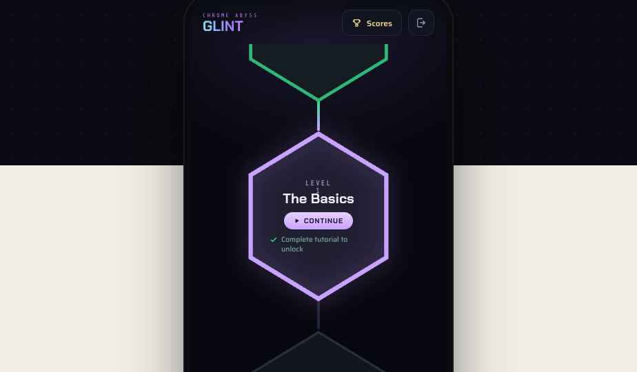
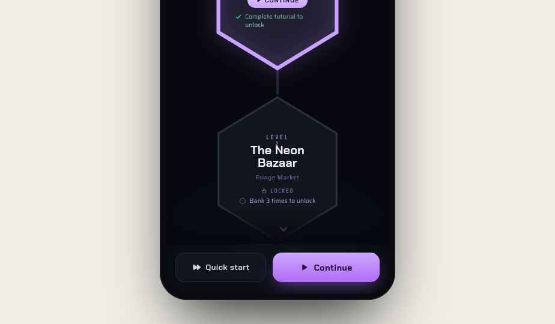
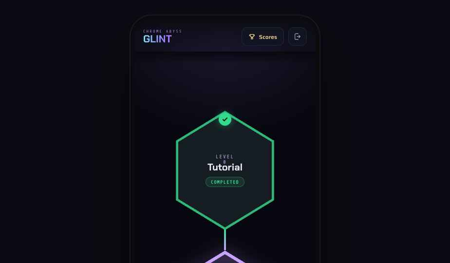
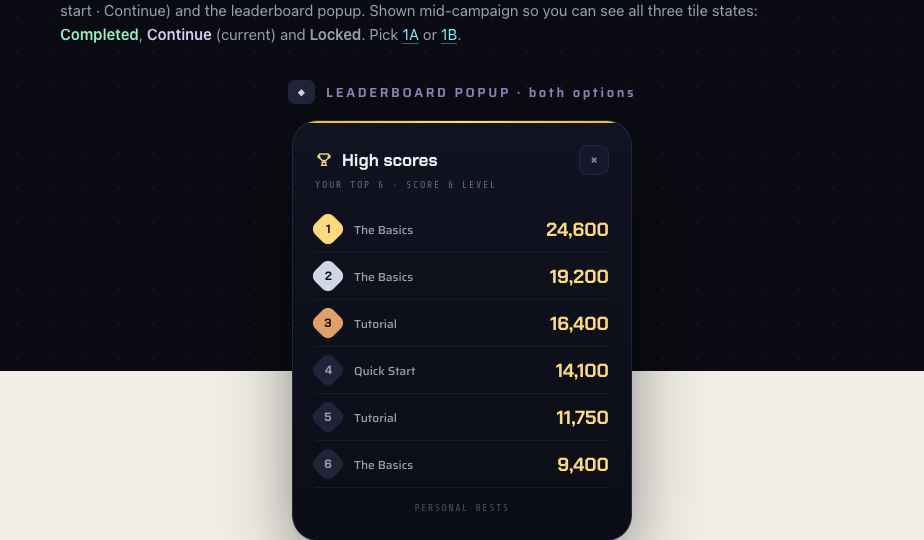

# Handoff: Chrome Abyss — Glint · **Level Select (campaign map)**

> The **LEVELS screen** — a vertical campaign map between the start screen and the game. Direction **1A "The Ascent"** (chosen). For the full game UI, gems, HUD and motion, see the master `design_handoff_glint` bundle.

---

## Overview
A scrollable vertical map of the campaign. Pointy-top hexagon **level tiles** are stacked on a central glowing **conduit**; one level fills the screen with the next lurking below. From here the player resumes the campaign (**Continue**), jumps into the standard game (**Quick start**), checks **High scores**, or **Exits** to the main menu.

## About the design files
HTML **design reference / working prototype** — recreate in the target codebase (**React, web**), don't ship as-is. `support.js` is the prototype runtime — **do not port**; read the template + logic class as the spec. Open **`Glint Level Select.dc.html`** in a browser: the list really scrolls (auto-positioned to the current level on load) and the **Scores** button opens the leaderboard.

## Fidelity
**High-fidelity** — final layout, colour, type, states, and behaviour.

---

## Screen anatomy (portrait, 392-wide)

**Top bar** — `CHROME ABYSS` kicker + **GLINT** wordmark (chrome gradient) on the left; on the right, a **Scores** button (trophy → opens the leaderboard) and, far right, an **Exit** button (door icon → back to main menu). Sits on a subtle top gradient so the list scrolls under it.

**Level path** — the scrollable body. Each level is a **pointy-top hexagon** (vertex at top & bottom) centred on a vertical **conduit** line that runs from one hex's bottom vertex to the next hex's top vertex. The conduit is **bright** (green→violet gradient) along the completed/travelled path and **dim** (`#222438`) ahead. A bottom fade + a bobbing chevron signal "more below". On load the list auto-scrolls so the **current** level is in view with the completed one above and the next lurking below.

**Bottom bar** — **Quick start** (ghost button → launches the standard game immediately) and **Continue** (primary purple → jumps to the last accessible level, i.e. the current one). Continue is the emphasised CTA.

**Leaderboard popup** — opened from **Scores**. A centred modal over a dimmed/blurred map: header "High scores", sub "YOUR TOP 6 · SCORE & LEVEL", then 6 rows of **rank badge · level won in · score** (score in gold; ranks 1–3 gold/silver/bronze diamond badges). Footer "PERSONAL BESTS". Close via × or backdrop tap.

---

## Level tile — on-screen content & states
Each tile shows (and **only** shows) these fields:
- **LEVEL** + number (mono kicker)
- **Name** (Chakra Petch)
- **Region** — small print (omitted for Tutorial & The Basics)
- **Status** — one of **COMPLETED** / **CONTINUE** / **LOCKED** (small)
- **Unlock requirement** — the single requirement line, with a **tick when achieved**

> The design goals in brackets in the content list below are **product logic, not on-screen text** — only the requirement line (e.g. "Clear 2 Dross in one game to unlock") is shown.

**Three states:**
| State | Hex | Badge / chrome | Requirement line |
|---|---|---|---|
| **Completed** | slate fill, **green** stroke, green ✓ medallion on the top vertex | `COMPLETED` chip (green) | hidden |
| **Current** | slate fill, **violet** stroke + outer glow, gently floating | `CONTINUE` pill (purple, ▶) | shown with a **green ✓** (requirement satisfied) |
| **Locked** | slate fill, dim stroke, lock icon, dimmed text | `LOCKED` (faint) | shown with an **empty circle** |

The prototype is shown **mid-campaign** (Tutorial completed, The Basics current, rest locked) so all three states are visible at once. On a fresh install, **Level 0 is the current level** and everything below is locked.

---

## The levels
The first 10 are authored (player can look ahead to Level 9); **beyond Level 9 the game auto-generates levels** with set unlock objectives (continue the escalating point-target ladder), so the list can grow indefinitely — the UI simply renders however many exist.

| # | Name | Region (small print) | Unlock requirement (on-screen) |
|---|---|---|---|
| 0 | Tutorial | — | — (unlocked from the start) |
| 1 | The Basics | — | Complete tutorial to unlock |
| 2 | The Neon Bazaar | Fringe Market | Bank 3 times to unlock |
| 3 | Iron Tide | Machina Forge | Clear 2 Dross in one game to unlock |
| 4 | Syndicate of Spires | Corporate Spire | Acquire a Nebulite to unlock |
| 5 | The Cyber Realm | Digital Nexus | Clear the board to unlock |
| 6 | The Ghost Network | Shadow Sector | Earn 15,000 points to unlock |
| 7 | The Tower of Truth | Divinity Enclave | Earn 20,000 points to unlock |
| 8 | The Abyss | Fringe Market | Earn 25,000 points to unlock |
| 9 | The Fortress | Military Bastion | Earn 30,000 points to unlock |

*(Product note, not shown on screen: a requirement is typically met by play in the preceding level — e.g. clearing 2 Dross in Level 2 unlocks Level 3; earning the point targets in the noted level unlocks 6/7. Evaluate requirements against run results and flip the tile to unlocked, ticking the requirement.)*

---

## Actions & routing
- **Tap a level** → unlocked levels start that level; locked levels are inert (optionally nudge/shake + show the requirement).
- **Continue** (bottom) → the last accessible level (current).
- **Quick start** (bottom) → the standard game (the master in-game screen) outside the campaign.
- **Scores** (top) → leaderboard popup.
- **Exit** (top) → main menu / start screen.

## Design tokens (essentials — full set in the master bundle)
- Surfaces: bg `#07080f` · card `#0d0f18`/`#101320` · hex fill `#13151e` · border `#262344` / hex stroke `#2a2d3c`
- Text: `#f1f0f8` / dim `#9b95bd` / faint `#6b6690`
- Status: current stroke `#c9a2ff` (glow `rgba(192,132,252,.6)`) · completed `#34d98b` · locked strokes/labels `#2a2d3c`/`#6b6690` · gold (scores) `#e8b53f`/`#ffd980`
- Conduit travelled: `linear-gradient(#34d98b,#c9a2ff)`; ahead: `#222438`
- Wordmark chrome: `linear-gradient(100deg,#7fe9f5,#9d7bff 52%,#e08bff 82%)`
- Type: Chakra Petch (wordmark, titles, buttons, scores) · Saira (labels, requirements) · Share Tech Mono (kickers, LEVEL n, statuses)
- Hexagon: pointy-top, `points="50,2 96,30 96,86 50,114 4,86 4,30"` on a `0 0 100 116` viewBox, rendered ~214×248 per tile.
- Radii: buttons/cards 12–26; pills 999.

## Renders

## Files
| File | What it is |
|---|---|
| `Glint Level Select.dc.html` | **The screen** — scrollable level path, states, bottom bar, and the leaderboard overlay (interactive). Start here. |
| `favicon.svg` | Gem favicon. |
| `support.js` | Prototype runtime only — **do not port**. |

## Implementation notes
- Build the list as a real scroll view; auto-scroll to the current level on entry (prototype does this in `componentDidMount`).
- Level tiles are data-driven — feed the campaign array (incl. auto-generated entries) and render the three states from a `status` field; the tick on the requirement is driven by whether the requirement is met.
- Region is a **small-print label** in this direction (no per-region colour coding).
- Dark mode is the hero; the same token names apply to a later light pass.
- Keep the conduit continuous through the list so the path reads as one climb; brighten the travelled segment.
