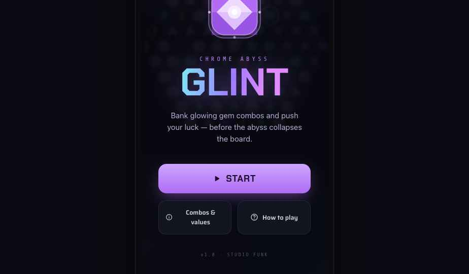

# Handoff: Chrome Abyss — Glint · **Opening / Start Screen**

> The **launch screen** shown when the app opens — title, one-line lore, and the entry actions. (Full game spec: master `design_handoff_glint`; onboarding: `design_handoff_glint_tutorial`.)

---

## Overview
A splash/start modal over a dimmed, blurred board. It introduces the game in a glance and offers three actions: **START**, **Combos & values** (the ⓘ reference), and **How to play** (the tutorial).

## About the design files
HTML **design reference / prototype** — recreate in the target codebase (**React, web**), don't ship as-is. `support.js` is the prototype runtime — **do not port**. Open **`Glint Start.dc.html`** in a browser.

## Fidelity
**High-fidelity** — final layout, colour, type, motion.

---

## Layout (portrait, centred column on a 392-wide screen)
Background: near-black `#07080f` with the Abyss nebula glow, a **dimmed blurred board** behind (`opacity .12`, `blur(2px)`), and a top→bottom scrim (`rgba(7,8,15,.55)→.82`). Content is vertically centred:

1. **Emblem** — a floating **Nebulite** gem (118px) with a pulsing purple halo behind it. `floatY` 5s + `haloPulse` 4s.
2. **Kicker** — `CHROME ABYSS`, Share Tech Mono, 12px, letter-spacing `.42em`, `accent` `#c084fc`.
3. **Wordmark** — **GLINT**, Chakra Petch 700, 76px, filled with the chrome gradient `linear-gradient(100deg,#7fe9f5,#9d7bff 48%,#e08bff 78%)` + `drop-shadow(0 3px 26px rgba(157,123,255,.55))`.
4. **Lore (one sentence)** — "Bank glowing gem combos and push your luck — before the abyss collapses the board." Saira 15px, `#b7b0d4`, max-width 280px.
5. **START** — primary, full-width (max 300px), 17px pad, radius 16, `linear-gradient(180deg,#cda6ff,#b06bf5)`, dark text `#1a0b2e`, Chakra Petch 18px + a play ▶ glyph; subtle looping `startGlow` shadow pulse.
6. **Secondary row** — two equal buttons (`flex:1`, `#12141f` / `#262344` border, radius 14): **Combos & values** (ⓘ icon) and **How to play** (? icon).
7. **Footer** — `v1.0 · STUDIO FUNK`, mono 10px, `#4f4a6b`.

**Entry animation:** kicker → wordmark → lore → secondary row stagger in with `riseIn` (14px rise + fade, ~0.5–0.7s, 50–200ms delays). START pulses; emblem floats.

## Behaviour
- **START** → dismiss the splash, begin a new game (the in-game screen).
- **Combos & values** → open the minerals/combos reference sheet (same one reachable from in-play ⓘ).
- **How to play** → open the 6-slide tutorial carousel (`design_handoff_glint_tutorial`).
- On first launch, consider auto-opening the tutorial after START; on return, START goes straight to play.

## Design tokens (essentials — full set in the master bundle)
bg `#07080f` · panel-hi `#12141f` · border `#262344` · accent `#c084fc` · text `#e7e9ef` / dim `#b7b0d4` / faint `#4f4a6b`. Chrome gradient as above. Type: Chakra Petch (wordmark/START), Saira (lore/buttons), Share Tech Mono (kicker/footer). Radii: buttons 14–16.

## Render

## Files
| File | What it is |
|---|---|
| `Glint Start.dc.html` | **The start screen** (template + light CSS motion). Start here. |
| `Board.dc.html` | Hex board — used dimmed as the backdrop. |
| `Gem.dc.html` | Faceted gem — the emblem (Nebulite). |
| `favicon.svg` | Gem favicon. |
| `support.js` | Prototype runtime only — **do not port**. |

## Implementation notes
- Keep the entry stagger subtle and quick; the emblem float + halo + START glow are ambient loops.
- Wire the three actions to the real game / sheet / tutorial; the reference sheet is shared with the in-play ⓘ (build once).
- Dark mode is the hero; same token names for a later light pass.
