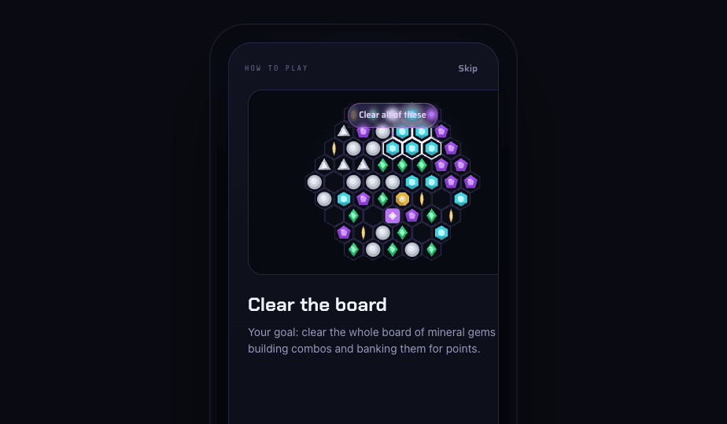
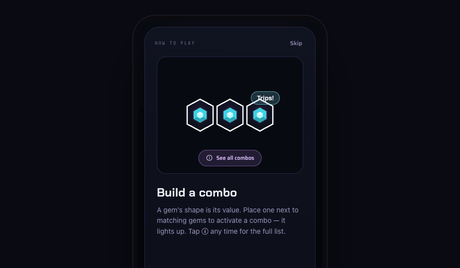

# Handoff: Chrome Abyss — Glint · **Onboarding Tutorial**

> This bundle is **specifically the how-to-play tutorial** — a 6-slide swipeable onboarding carousel for *Chrome Abyss: Glint*. (For the full game UI, gems, HUD, screens and motion, see the master `design_handoff_glint` bundle.)

---

## Overview
A first-run / on-demand **tutorial modal** that teaches the loop in six glanceable cards, then drops the player into the game. It opens automatically on first run and any time from the **Help (?)** button in the in-game footer.

## About the design files
The files here are **HTML design references** (a working prototype), not production code. **Recreate the tutorial in the target codebase** (the game is built in **React (web)**) using its component and animation patterns. `support.js` is the prototype runtime only — **do not port it**; read the template + logic class as the spec. The carousel is fully interactive in the prototype — open **`Glint Tutorial.dc.html`** in a browser and swipe through it.

## Fidelity
**High-fidelity.** Final layout, type, colour, and interaction. Build it faithfully.

---

## The carousel — structure & behaviour
A modal over a **dimmed game board** (`rgba(6,7,14,.7)` scrim on a blurred board). Portrait, mobile-first, ~344px-wide rounded card (radius 30) on `linear-gradient(180deg,#101320,#0b0d16)`, `#262344` border, lift shadow.

**Chrome (persistent, outside the sliding track):**
- **Top bar:** `HOW TO PLAY` kicker (mono) + a persistent **Skip** (top-right, dismisses to the game).
- **Track:** six slides in a flex row; the track translates `translateX(-slide*100%)` with a `.38s cubic-bezier(.4,0,.2,1)` transition.
- **Dot indicators:** six dots; the active dot widens to a `22px` pill in **`#c084fc`** (others `#2c2950`, 7px).
- **Nav row:** **Back** (ghost, shown when not on slide 1) + **Next** (primary purple) — on slide 6 Next becomes **Got it — Play** (green `#34d98b` gradient).

**Navigation:** swipe (pointer-drag, **±45px** threshold → next/prev), Next/Back, or tap a dot. **State:** `slide` (0–5), `showCombos` (bool), `dismissed` (bool). Dismiss (Skip / Got it — Play) hides the modal and reveals the game; a **Replay tutorial** affordance brings it back.

**Callouts** are **soft pointers** — small pills (accent / `good` / violet) with a thin connector line, sitting in the scene — *not* heavy tooltips.

---

## Slides (copy is intentionally short — glanceable cards)

| # | Title | Visual | Copy |
|---|---|---|---|
| 1 | **Clear the board** | Full board + a "Clear all of these" pointer pill (accent) | "Your goal: clear the whole board of mineral gems — by building combos and banking them for points." |
| 2 | **Your tiles: now & next** | Big **NOW PLACING** slot ("place this", `good` pill) + the hidden **UP NEXT** hex-stack ("hidden", violet pill) | "You place one gem at a time. UP NEXT counts your tiles — but their values stay hidden. Not knowing what's coming is the gamble." |
| 3 | **Build a combo** | Three matched gems glowing white + a **"Trips!"** pointer; a **See all combos** chip | "A gem's shape is its value. Place one next to matching gems to activate a combo — it lights up. Tap ⓘ any time for the full list." |
| 4 | **Bank for points** | Cluster banking to SCORE with a **×6** multiplier badge ("6 connected = bank!") | "When a glowing group reaches 6 connected tiles it banks — you score and they clear. Finish on a high-value gem for a bigger ×multiplier." |
| 5 | **Push your luck** | Timed **BANK** button (3-2-1) + BANKS ◆◆◆ / BUSTS ♥♥♥ pips | "Push for a bigger combo — but place a gem that can't combo and you bust, losing the group. 3 lives, 3 free banks. Tap BANK to lock safe points first." |
| 6 | **Traps, treasure & the collapse** | Dross (trap) + Nebulite (+500), **COLLAPSE 91→61**, **BOARD CLEARED** | "Dross is worthless gold — it always busts. Nebulite copies neighbours, pays +500. Midway the Abyss collapses and the board shrinks. Clear it to win!" |

### The ⓘ combos reference (Slide 3 → and in-play)
Slide 3's **See all combos** opens the full reference **inline** (and the same reference must be reachable from the **ⓘ** during play): **Echo** (Pair of 2s/6s) 300 · **Trips** (3 of a kind) 300 · **Quad** 400 · **Pentad** 500 · **Hex** (6 of a kind — banks alone) 600 · **Drift** (4 in a run) 400 · **Full Drift** (6 in a run — banks alone) 800 · **Chains** = two combos in one bank, summed after the ×multiplier.

---

## Design tokens (essentials — full set in the master bundle)
- Surfaces: bg `#07080f` · panel `#0e1018` · panel-hi `#15182a` · border `#2a2748`
- Text: `#f1f0f8` / dim `#9b95bd` / faint `#6b6690`
- Brand/status: accent `#c084fc` · gold `#e8b53f` · good `#34d98b` · bad `#ff5a76`
- Chrome gradient (wordmark): `linear-gradient(100deg,#7fe9f5,#9d7bff 50%,#e08bff 85%)`
- Type: display **Chakra Petch** (titles/score), body **Saira**, mono **Share Tech Mono** (kickers)
- Radii: card 30 · chips/buttons 12–13 · pills 999

## Renders
`renders/` — slides 1, 3, 6 captured from the prototype.

## Files
| File | What it is |
|---|---|
| `Glint Tutorial.dc.html` | **The tutorial** — full carousel (template + interactive logic class). Start here. |
| `Gem.dc.html` | Faceted gem component (used in slides). |
| `Cell.dc.html` | Hex well + gem + state rings. |
| `Board.dc.html` | The hex board (slides 1 & backdrop). |
| `favicon.svg` | Gem favicon. |
| `support.js` | Prototype runtime only — **do not port**. |

## Implementation notes
- Build the carousel with the codebase's animation lib (Framer Motion / CSS transitions); keep the `±45px` swipe threshold and the dot/Skip/Back/Next chrome.
- Copy stays short — these are glanceable cards, not paragraphs.
- The combos reference is shared with in-play **ⓘ** — implement it once and open it from both places.
- Dark mode is the hero; same token names apply to a later light pass.
